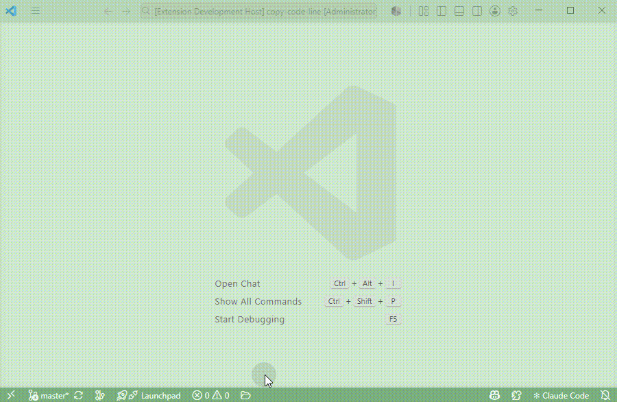

# Simple File Explorer

A clean-room VS Code extension that provides a Windows-style, tabbed file browser
for Visual Studio Code.

Thanks for using Simple File Explorer. Feedback, bug reports, and workflow
suggestions are welcome through the GitHub issue tracker.

Important: use this tool like Windows File Explorer. Common mouse actions,
selection patterns, and keyboard habits should work naturally, so you do not
need to memorize a separate command list.


## Opening Simple File Explorer

Use any of these methods:

- Press `Ctrl+Alt+Q` on Windows/Linux or `Cmd+Alt+Q` on macOS to toggle the
  editor explorer open or closed.
- Open the Command Palette with `Ctrl+Shift+P` or `F1`, then run
  **Simple File Explorer: Open**.
- Click the folder icon added to the VS Code status bar.
- If `simpleFileExplorer.viewLocation` is set to `sidebar`, click the Simple
  File Explorer icon in the Activity Bar.
- In the built-in VS Code Explorer, right-click a file or folder and select
  **Show in Simple File Explorer**.
- In an editor tab context menu, select **Show in Simple File Explorer** to
  open the containing folder and select the active file.

By default, Simple File Explorer opens in the editor area. Set
`simpleFileExplorer.viewLocation` to `sidebar` to use the Activity Bar sidebar
view instead; in sidebar mode the Activity Bar entry is shown and the status bar
button is hidden. The shortcut toggles the editor explorer when it is already
open. Use the toolbar location button to move the current explorer between the
editor area and sidebar.

## Demo




## Current features

- Starts at the current VS Code workspace folder.
- Toggles the editor explorer with `Ctrl+Alt+Q` (`Cmd+Alt+Q` on macOS).
- Opens in the editor area by default.
- Optional Activity Bar sidebar mode.
- Toolbar button for switching between editor and sidebar modes.
- Fills the available editor or sidebar surface without extra webview padding.
- Opens files and folders from the built-in VS Code Explorer context menu.
- Reveals the active editor tab file in Simple File Explorer from the editor
  tab context menu.
- One-click return to the workspace root.
- In multi-root workspaces, Home returns to the root containing the current path.
- Multiple independent file tabs.
- Drag-and-drop tab ordering.
- Editor-only tiled tabs mode shows all open file tabs as independent panes in
  one editor surface.
- Tiled tabs keep per-pane navigation, address bars, search fields, selection,
  and file operations while sharing display controls.
- Tiled tabs mode is restored with the workspace session when at least two tabs
  are open.
- Sidebar tabs automatically shrink to keep the new-tab button reachable.
- Sidebar toolbar actions are grouped, with display controls visually separated
  from navigation and create actions.
- Compact sidebar layout supports very narrow sidebars, including one-column
  large-icon browsing and compact details columns.
- Optional workspace-specific restoration of tab order, paths, and active tab.
- One initial tab per root folder in multi-root workspaces without saved state.
- Back, forward, up, refresh, breadcrumbs, and manual path entry (`Ctrl+L`).
- Address-bar recent and favorite locations menu for quickly returning to
  important folders in the current workspace.
- Address-bar star button for adding or removing the current folder as a
  workspace favorite.
- Detailed list and large-icon views.
- Large-icon view expands selected filenames, including multi-selection, while
  keeping unselected items compact.
- A shared view-mode preference that persists across tabs and VS Code sessions.
- Optional editor-only folder tree for navigation, with a collapse-all control
  and persisted visibility/expanded state.
- The editor folder tree lazily follows the active folder path from the main
  file view without expanding sibling folders.
- Tree folders can be expanded or collapsed from the arrow, by double-clicking,
  or by pressing `Enter` after the tree was the most recent navigation target.
- Large-icon view keeps its column layout when the editor folder tree is shown
  or hidden.
- Automatically reuses the current VS Code file icon theme when possible, with
  built-in fallback icons.
- Streaming directory enumeration and virtualized rendering for large folders.
- Visible-row metadata loading instead of running `stat` for every file at once.
- Metadata reads are de-duplicated and concurrency-limited during large-folder
  browsing.
- Current-folder filtering and cancellable recursive filename search.
- Recursive search reuses VS Code `search.exclude` and `files.exclude`
  directory exclusions when they can be safely interpreted as directory names.
- Persistent recursive-search mode and basic filename wildcards (`*` and `?`).
- Windows and Linux path handling.
- Automatic refresh using debounced, non-recursive watchers for visible tabs.
- Safe fallback to an existing parent or workspace root when an open directory
  is deleted.
- New files open and focus automatically after creation.
- New file, new folder, rename, move-to-trash, and permanent-delete operations.
- Multi-selection with `Ctrl` / `Cmd` click, `Shift` click, keyboard navigation,
  mouse box selection, and `Ctrl+A` / `Cmd+A`.
- Empty-area context menus can create files or folders, refresh the current
  folder, open a terminal, copy the current folder path, or paste files.
- Copy, cut, paste, and empty-area paste from keyboard shortcuts or the context
  menu, with newly pasted items selected together.
- Copy, move, trash, and permanent-delete operations show VS Code progress
  notifications for longer operations.
- Sortable name, modified-time, and size columns.
- Right-click menu toggles for the modified-time and size columns.
- Per-tab hidden dot-file visibility.
- Context-menu reveal in the operating system file explorer.
- Context-menu text-copy actions for item names, item paths, workspace-relative
  item paths, file folder paths, and workspace-relative file folder paths.
- Context-menu terminal launch from the selected file's containing folder, the
  selected folder, or the current empty-area folder.
- Search-result navigation to the containing folder with the item selected.
- Explorer shortcuts: `/`, `Backspace`/`Alt+Up`, `Alt+Left`, `Alt+Right`, `F5`,
  `Ctrl+L`, `Enter`, `Space`, `F2`, `Delete`, `Shift+Delete`, `Ctrl+A`, arrow
  key selection, and incremental filename selection by typing.

## Command Palette Actions

These actions are available from the Command Palette and Keyboard Shortcuts
editor. Except for **Simple File Explorer: Toggle**, they do not define default
keyboard shortcuts, so you can bind only the commands you need.

- **Simple File Explorer: Toggle** — toggle the editor explorer.
- **Simple File Explorer: Move Between Editor and Sidebar** — switch the current
  explorer location.
- **Simple File Explorer: New Tab**, **Close Tab**, **Next Tab**,
  **Previous Tab**, and **Activate Tab 1-9** — manage explorer tabs.
- **Simple File Explorer: Focus Search** — focus the active search box.
- **Simple File Explorer: Focus Address Bar** — edit the active path.
- **Simple File Explorer: Toggle Hidden Files** — show or hide dot files.
- **Simple File Explorer: Details View** and **Large Icons** — switch display
  modes.
- **Simple File Explorer: Toggle Folder Tree** and **Collapse Folder Tree** —
  control the editor-only navigation tree.
- **Simple File Explorer: Toggle Tiled Tabs** — switch between tab view and
  tiled-pane view in the editor explorer.

## Development

```bash
npm install
npm run compile
npm test
```

Press `F5` in VS Code and run `Simple File Explorer: Open` in the Extension
Development Host.

## Settings

- `simpleFileExplorer.restoreWorkspaceSession` — restore tab order, current
  paths, and the active tab separately for each workspace. Default: `true`.
- `simpleFileExplorer.viewLocation` — choose where the explorer opens:
  `editor` or `sidebar`. Default: `editor`.
- `simpleFileExplorer.iconThemeMode` — choose file and folder icons:
  `auto` reuses the current VS Code file icon theme when possible, while
  `codicon` always uses the built-in fallback icons. In Remote SSH windows,
  `auto` can only reuse icon themes available to the remote extension host;
  otherwise the built-in fallback icons are used. Default: `auto`.
- `simpleFileExplorer.treeProbeChildFolders` — check whether folders in the
  editor tree have visible child folders before showing expand arrows. Default:
  `false` for better performance.

## Folder Tree Performance

The editor-only folder tree is lazy loaded. It reads child folders only when a
tree node is expanded, and it does not recursively expand the full workspace.
When the main file view navigates to a folder, the tree lazily expands only the
ancestor chain required to reveal that folder.
By default the tree does not probe child folders before expansion, so unloaded
folders show an expand arrow and folders without visible child folders lose the
arrow after they are opened. Enable `simpleFileExplorer.treeProbeChildFolders`
to check one level below visible child folders as they are loaded and hide those
arrows up front.

When the folder tree is hidden, it is not rendered and does not issue tree
directory reads. In editor mode the webview context is retained while hidden so
returning to the explorer does not reset the tree state; this keeps a small
amount of webview state in memory.

## Scope

This project does not copy source code, styles, or assets from
`Abdulkader-Safi/vscode-file-explorer`. It independently implements a similar
high-level product concept.

## Platform support

- Windows and Linux are supported.
- Remote SSH workspaces are supported. The extension runs on the remote
  workspace host so file browsing and file operations apply to remote files.
  **Reveal in System File Manager** is hidden in remote windows because remote
  paths cannot reliably be opened in the local operating system file manager.
  File icon themes can be reused only when the theme is also available to the
  remote extension host; otherwise icons fall back to the built-in Codicon set.
- macOS should work through the same Node.js and VS Code APIs, but is not yet
  part of the tested release matrix.
- Browser-only VS Code environments are not supported because local directory
  streaming uses the Node.js file system API.

## License

The extension source is licensed under the MIT License. The bundled VS Code
Codicon artwork has separate attribution in `THIRD_PARTY_NOTICES.md`.

---

# 中文说明

Simple File Explorer 是一个运行在 VS Code 中的多页签文件浏览器，操作方式接近
Windows 资源管理器。它适合在大型项目中按目录浏览和查找文件，避免在 VS Code
自带的树形 Explorer 中反复展开大量目录。

感谢使用 Simple File Explorer。如果你遇到问题，或对工作流、交互细节有建议，
欢迎通过 GitHub issue 反馈。

重要提示：你可以像使用 Windows File Explorer 一样使用这个工具。常见的鼠标
操作、选择方式和键盘习惯应当自然可用，不需要特意记住额外规则。

## 打开方式

可以通过以下任意方式打开：

- Windows/Linux 使用 `Ctrl+Alt+Q`，macOS 使用 `Cmd+Alt+Q`，用于打开或关闭
  editor 模式的浏览器。
- 按 `Ctrl+Shift+P` 或 `F1` 打开命令面板，然后执行
  **Simple File Explorer: Open**。
- 默认使用 editor 主编辑区模式，可以点击 VS Code 底部状态栏中的文件夹图标
  打开、聚焦或关闭。
- 如果将 `simpleFileExplorer.viewLocation` 设置为 `sidebar`，可以点击 Activity
  Bar 中的 Simple File Explorer 图标。
- 在 VS Code 自带 Explorer 中右键文件或目录，选择
  **Show in Simple File Explorer**。
- 在编辑器页签右键菜单中选择 **Show in Simple File Explorer**，可以打开当前
  文件所在目录并选中该文件。

快捷键会在 editor 模式下切换 Simple File Explorer 的打开和关闭。默认 editor
模式会显示底部状态栏按钮，并隐藏 Activity Bar 入口；切换到 sidebar 模式后则相反。
也可以通过工具栏中的位置切换按钮在 editor 和 sidebar 模式之间移动当前浏览器。

## 主要功能

- 多页签、前进、后退、向上、工作区首页和手动路径输入。
- 多根工作区中，首页按钮会返回当前路径所属的工作区根目录。
- 支持拖动页签调整顺序。
- editor 模式支持平铺页签视图，可将当前打开的页签同时显示为多个独立 pane。
- 平铺视图中，每个 pane 保留独立的导航、地址栏、搜索框、选择和文件操作，
  列表/大图标/隐藏文件等显示控制统一作用于所有 pane。
- 当至少有两个页签时，平铺视图会随工作区会话一起恢复。
- 会铺满 editor 或 sidebar 可用区域，不保留额外 webview 边距。
- 侧边栏页签会自动压缩宽度，保持新建页签按钮可用。
- 侧边栏工具栏按导航、新建和显示控制分组，列表/图标等显示选项会单独区分。
- 更紧凑的侧边栏布局支持很窄的宽度，包括大图标视图一行一个图标和紧凑的
  详细信息列。
- 可按工作区恢复页签顺序、当前路径和活动页签。
- 多根工作区在没有保存状态时，会为每个根目录创建一个初始页签。
- 地址栏提供最近位置和收藏位置下拉菜单，可快速回到当前工作区中的常用目录。
- 地址栏星标按钮可将当前目录加入或移出当前工作区收藏。
- 详细信息和大图标两种视图，并在所有页签和下次启动时继承视图设置。
- 大图标视图中，选中的文件会展开显示完整文件名，多选时每个选中项都会展开。
- editor 模式可开启左侧文件夹树用于导航，支持一键合并，并会保存显示和展开状态。
- 主文件区切换目录时，左侧文件夹树会懒加载并展开当前路径的祖先链，不会展开旁支目录。
- 树形目录可以通过箭头、双击，或在最近操作目标为树时按 `Enter` 展开和折叠。
- editor 模式下切换左侧文件夹树时，大图标视图会保持正确列数。
- 默认尝试复用当前 VS Code 文件图标主题，失败时回退到内置图标。
- 大目录流式读取、虚拟滚动和可见区域元数据加载。
- 元数据读取会去重并限制并发，降低大目录浏览时的文件系统压力。
- 当前目录搜索和可取消的递归文件名搜索。
- 递归搜索会复用 VS Code 的 `search.exclude` 和 `files.exclude` 中可安全识别的目录排除规则。
- 递归搜索模式会跨目录、页签和 VS Code 启动保留。
- 文件名搜索支持基础通配符：`*` 匹配任意字符，`?` 匹配单个字符。
- 新建文件后会自动打开并聚焦。
- 新建、重命名、删除到回收站、永久删除、复制、剪切和粘贴。
- 空白区域右键菜单可在当前目录中新建文件或文件夹、刷新当前目录、打开终端、
  复制当前目录路径或粘贴文件。
- 复制、移动、删除到回收站和永久删除会显示 VS Code 进度提示。
- 支持 `Ctrl` 点击、`Shift` 点击、鼠标框选和 `Ctrl+A` 全选。
- 支持方向键移动焦点、`Space` 选择、`Ctrl`/`Shift` 配合键盘进行多选和范围选择。
- 支持右键菜单复制、剪切、粘贴、重命名、删除，以及空白区域粘贴；粘贴多个文件后会
  同时选中新生成的内容。
- 右键菜单支持复制名称、路径、工作区相对路径、文件所在文件夹路径，以及文件所在
  文件夹的工作区相对路径，并写入 VS Code 文本剪贴板。
- 右键菜单支持在当前位置打开终端；文件会使用所在目录，文件夹会使用自身目录，
  空白区域会使用当前浏览目录。
- 可从编辑器页签右键菜单中将当前文件定位到 Simple File Explorer。
- 可通过工具栏按钮在 editor 和 sidebar 显示模式之间快速切换。
- 按名称/修改时间/大小排序、隐藏点文件切换。
- 可通过右键菜单显示或隐藏修改时间和大小列。
- 自动刷新当前打开目录，不递归监控整个项目。
- 当前打开目录被删除时，自动回退到有效父目录或其他工作区根目录。
- 支持 Windows 和 Linux；macOS 理论兼容但尚未正式测试。
- 支持 Remote SSH 工作区。扩展会运行在远程 workspace host 上，因此浏览和文件
  操作会作用于远程文件；远程窗口中会隐藏 **Reveal in System File Manager**，
  因为远程路径无法可靠地在本地系统文件管理器中打开。文件图标主题只有在远程
  extension host 也可访问时才能复用，否则会回退到内置 Codicon 图标。

## 常用快捷键

- `Ctrl+L`：输入路径。
- `Backspace` / `Alt+Up`：返回上级目录。
- `Alt+Left` / `Alt+Right`：后退或前进。
- `Enter`：进入选中的目录或打开文件。
- `F2`：重命名。
- `Delete`：移动到回收站。
- `Shift+Delete`：确认后永久删除。
- `Ctrl+C` / `Ctrl+X` / `Ctrl+V`：复制、剪切和粘贴。
- `Ctrl+A` / `Cmd+A`：全选当前显示的文件，包括搜索结果。
- `/`：聚焦当前搜索框。
- `方向键`：在文件区移动选择；`Ctrl` 只移动焦点，`Shift` 扩展范围选择。
- `Space`：选择当前焦点项；`Ctrl+Space` 切换当前焦点项的选中状态。
- `F5`：刷新当前目录。
- 在非输入框中直接输入字符：按文件名前缀快速选中。

## 命令面板动作

这些动作可以在命令面板和 VS Code 键盘快捷方式中搜索到。除了
**Simple File Explorer: Toggle** 之外，它们都不带默认快捷键；需要时可以只绑定
自己常用的命令。

- **Simple File Explorer: Toggle**：切换 editor 浏览器显示。
- **Simple File Explorer: Move Between Editor and Sidebar**：在 editor 和 sidebar
  之间移动当前浏览器。
- **Simple File Explorer: New Tab**、**Close Tab**、**Next Tab**、
  **Previous Tab** 和 **Activate Tab 1-9**：管理浏览器页签。
- **Simple File Explorer: Focus Search**：聚焦当前搜索框。
- **Simple File Explorer: Focus Address Bar**：编辑当前路径。
- **Simple File Explorer: Toggle Hidden Files**：显示或隐藏点文件。
- **Simple File Explorer: Details View** 和 **Large Icons**：切换显示模式。
- **Simple File Explorer: Toggle Folder Tree** 和 **Collapse Folder Tree**：
  控制 editor 模式下的文件夹树。
- **Simple File Explorer: Toggle Tiled Tabs**：在 editor 浏览器的普通页签和平铺
  pane 视图之间切换。

## 设置

- `simpleFileExplorer.restoreWorkspaceSession`：按工作区恢复页签顺序、
  当前路径和活动页签，默认开启。
- `simpleFileExplorer.viewLocation`：选择显示位置，可选 `editor` 或 `sidebar`，
  默认 `editor`。
- `simpleFileExplorer.iconThemeMode`：选择文件和文件夹图标，`auto` 会尽量复用
  当前 VS Code 文件图标主题，`codicon` 始终使用内置兜底图标。Remote SSH 窗口中，
  `auto` 只能复用远程 extension host 可访问的图标主题；否则会回退到内置图标。
  默认 `auto`。
- `simpleFileExplorer.treeProbeChildFolders`：在 editor 树形导航中提前检查文件夹
  是否有可见子文件夹，再决定是否显示展开箭头。默认关闭以获得更好的性能。

## 树形导航性能

左侧文件夹树仅在 editor 模式可用，并采用懒加载。只有展开某个树节点时，
才读取该目录下的子文件夹，不会递归展开整个工作区。默认不会在展开前探测
子目录，因此未加载的文件夹会显示展开箭头；如果展开后没有可见子目录，箭头
会自动消失。开启 `simpleFileExplorer.treeProbeChildFolders` 后，加载某层
目录时会额外检查可见子文件夹的下一层，从而提前隐藏这些箭头。

当主文件区导航到某个目录时，树形导航会只沿当前路径的祖先链逐级展开。
如果某一级还没有加载，只会读取这一层，等返回后继续展开下一层，不会扫描
兄弟目录。

隐藏文件夹树时，不会渲染树，也不会发起树形目录读取。editor 模式下会保留
webview 上下文，切换到文件编辑器再回来时不会重置树状态；代价是隐藏时会保留
少量 webview 内存状态。
