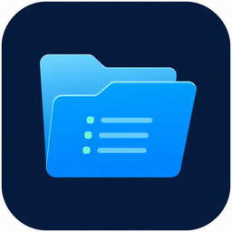
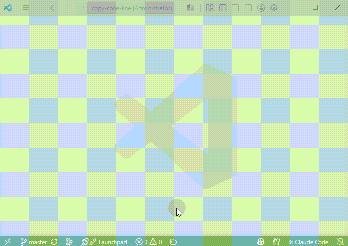

# Simple File Explorer

A clean-room VS Code extension that provides a Windows-style, tabbed file browser
for Visual Studio Code.



## Opening File Explorer

Use any of these methods:

- Press `Ctrl+Alt+E` on Windows/Linux or `Cmd+Alt+E` on macOS.
- Open the Command Palette with `Ctrl+Shift+P` or `F1`, then run
  **Simple File Explorer: Open**.
- Click the Simple File Explorer icon in the Activity Bar.
- If `simpleFileExplorer.viewLocation` is set to `editor`, click the folder icon
  added to the VS Code status bar.
- In the built-in VS Code Explorer, right-click a file or folder and select
  **Open in Simple File Explorer**.

By default, Simple File Explorer opens in the sidebar. Set
`simpleFileExplorer.viewLocation` to `editor` to use the full editor-tab view
instead; in editor mode the Activity Bar entry is hidden and the status bar
button is shown. The command focuses the existing explorer view when it is
already open.

## Demo



## Current features

- Starts at the current VS Code workspace folder.
- Opens or focuses with `Ctrl+Alt+E` (`Cmd+Alt+E` on macOS).
- Opens in the Activity Bar sidebar by default.
- Optional editor-tab mode with a status bar button.
- Opens files and folders from the built-in VS Code Explorer context menu.
- One-click return to the workspace root.
- In multi-root workspaces, Home returns to the root containing the current path.
- Multiple independent file tabs.
- Drag-and-drop tab ordering.
- Sidebar tabs automatically shrink to keep the new-tab button reachable.
- Optional workspace-specific restoration of tab order, paths, and active tab.
- One initial tab per root folder in multi-root workspaces without saved state.
- Back, forward, up, refresh, breadcrumbs, and manual path entry (`Ctrl+L`).
- Detailed list and large-icon views.
- A shared view-mode preference that persists across tabs and VS Code sessions.
- Streaming directory enumeration and virtualized rendering for large folders.
- Visible-row metadata loading instead of running `stat` for every file at once.
- Current-folder filtering and cancellable recursive filename search.
- Persistent recursive-search mode and basic filename wildcards (`*` and `?`).
- Windows and Linux path handling.
- Automatic refresh using debounced, non-recursive watchers for visible tabs.
- Safe fallback to an existing parent or workspace root when an open directory
  is deleted.
- New file, new folder, rename, move-to-trash, and permanent-delete operations.
- Multi-selection with `Ctrl` / `Cmd` click, `Shift` click, mouse box selection,
  and `Ctrl+A` / `Cmd+A`.
- Copy, cut, paste, and empty-area paste from keyboard shortcuts or the context
  menu.
- Sortable name, modified-time, and size columns.
- Right-click menu toggles for the modified-time and size columns.
- Per-tab hidden dot-file visibility.
- Context-menu reveal in the operating system file explorer.
- Search-result navigation to the containing folder with the item selected.
- Explorer shortcuts: `Backspace`/`Alt+Up`, `Alt+Left`, `Alt+Right`, `F5`,
  `Ctrl+L`, `Enter`, `F2`, `Delete`, `Shift+Delete`, `Ctrl+A`, and incremental
  filename selection by typing.

## Development

```bash
npm install
npm run compile
```

Press `F5` in VS Code and run `File Explorer: Open` in the Extension Development
Host.

## Settings

- `simpleFileExplorer.restoreWorkspaceSession` — restore tab order, current
  paths, and the active tab separately for each workspace. Default: `true`.
- `simpleFileExplorer.viewLocation` — choose where the explorer opens:
  `sidebar` or `editor`. Default: `sidebar`.

## Scope

This project does not copy source code, styles, or assets from
`Abdulkader-Safi/vscode-file-explorer`. It independently implements a similar
high-level product concept.

## Platform support

- Windows and Linux are supported.
- macOS should work through the same Node.js and VS Code APIs, but is not yet
  part of the tested release matrix.
- Browser-only VS Code environments are not supported because local directory
  streaming uses the Node.js file system API.

## License

The extension source is licensed under the MIT License. The bundled VS Code
Codicon artwork has separate attribution in `THIRD_PARTY_NOTICES.md`.

---

# 中文说明

Simple File Explorer 是一个运行在 VS Code 中的多页签文件浏览器，操作方式接近
Windows 资源管理器。它适合在大型项目中按目录浏览和查找文件，避免在 VS Code
自带的树形 Explorer 中反复展开大量目录。

## 打开方式

可以通过以下任意方式打开：

- Windows/Linux 使用 `Ctrl+Alt+E`，macOS 使用 `Cmd+Alt+E`。
- 按 `Ctrl+Shift+P` 或 `F1` 打开命令面板，然后执行
  **Simple File Explorer: Open**。
- 默认使用侧边栏模式，点击 Activity Bar 中的 Simple File Explorer 图标。
- 如果将 `simpleFileExplorer.viewLocation` 设置为 `editor`，可以点击 VS Code
  底部状态栏中的文件夹图标打开、聚焦或关闭。
- 在 VS Code 自带 Explorer 中右键文件或目录，选择
  **Open in Simple File Explorer**。

快捷键和命令会优先切换到已经打开的 File Explorer。默认侧边栏模式会显示
Activity Bar 入口，并隐藏底部状态栏按钮；切换到 editor 模式后则相反。

## 主要功能

- 多页签、前进、后退、向上、工作区首页和手动路径输入。
- 多根工作区中，首页按钮会返回当前路径所属的工作区根目录。
- 支持拖动页签调整顺序。
- 侧边栏页签会自动压缩宽度，保持新建页签按钮可用。
- 可按工作区恢复页签顺序、当前路径和活动页签。
- 多根工作区在没有保存状态时，会为每个根目录创建一个初始页签。
- 详细信息和大图标两种视图，并在所有页签和下次启动时继承视图设置。
- 大目录流式读取、虚拟滚动和可见区域元数据加载。
- 当前目录搜索和可取消的递归文件名搜索。
- 递归搜索模式会跨目录、页签和 VS Code 启动保留。
- 文件名搜索支持基础通配符：`*` 匹配任意字符，`?` 匹配单个字符。
- 新建、重命名、删除到回收站、永久删除、复制、剪切和粘贴。
- 支持 `Ctrl` 点击、`Shift` 点击、鼠标框选和 `Ctrl+A` 全选。
- 支持右键菜单复制、剪切、粘贴、重命名、删除，以及空白区域粘贴。
- 按名称/修改时间/大小排序、隐藏点文件切换。
- 可通过右键菜单显示或隐藏修改时间和大小列。
- 自动刷新当前打开目录，不递归监控整个项目。
- 当前打开目录被删除时，自动回退到有效父目录或其他工作区根目录。
- 支持 Windows 和 Linux；macOS 理论兼容但尚未正式测试。

## 常用快捷键

- `Ctrl+L`：输入路径。
- `Backspace` / `Alt+Up`：返回上级目录。
- `Alt+Left` / `Alt+Right`：后退或前进。
- `Enter`：进入选中的目录或打开文件。
- `F2`：重命名。
- `Delete`：移动到回收站。
- `Shift+Delete`：确认后永久删除。
- `Ctrl+C` / `Ctrl+X` / `Ctrl+V`：复制、剪切和粘贴。
- `Ctrl+A` / `Cmd+A`：全选当前显示的文件，包括搜索结果。
- `F5`：刷新当前目录。
- 在非输入框中直接输入字符：按文件名前缀快速选中。

## 设置

- `simpleFileExplorer.restoreWorkspaceSession`：按工作区恢复页签顺序、
  当前路径和活动页签，默认开启。
- `simpleFileExplorer.viewLocation`：选择显示位置，可选 `editor` 或 `sidebar`，
  默认 `sidebar`。
